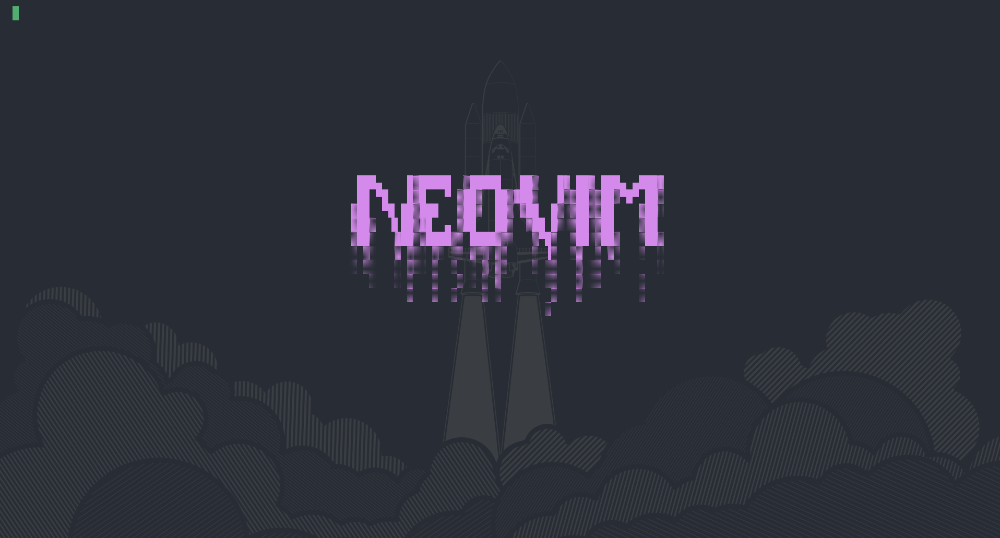
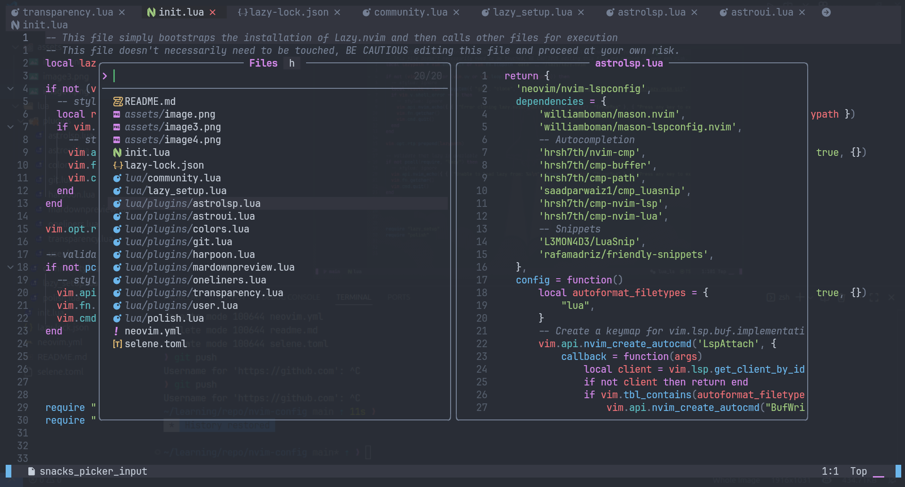
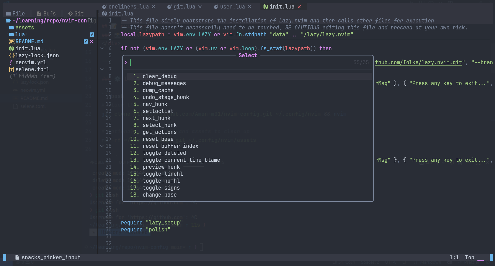
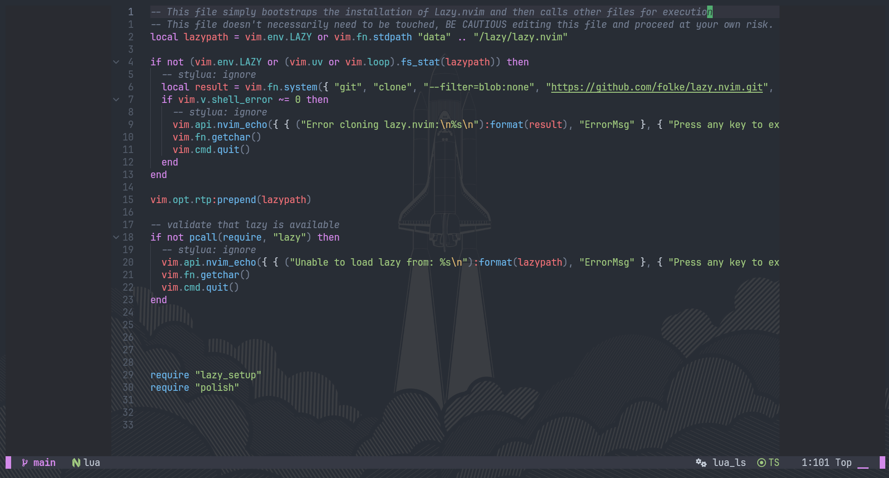

## 📝 Neovim-config

This is my customized setup of AstroNvim, enhanced with additional plugins, key mappings, and productivity tools.

---

### 📸 Screenshots

<div align="center">
  
  <br><br>
  
  
</div>

---

### 🚀 features

- Built on top of AstroNvim (fully supports all its default keybindings and plugins)
- Minimal, fast, and visually clean with added transparency
- Rich plugin support for:

  - Enhanced LSP support
  - Markdown preview
  - Zen writing mode
  - Smooth scrolling
  - Git integration
  - Project navigation with Harpoon
  - And more...

  ### ⚙️ Installation

```bash
# Clone the config
git clone https://github.com/Aman-m01/nvim-config.git ~/.config/nvim && nvim

# Optional: remove .git and assets to clean up
rm -rf ~/.config/nvim/.git ~/.config/nvim/assets

# Uninstall
rm -rf ~/.config/nvim
rm -rf ~/.local/state/nvim
rm -rf ~/.local/share/nvim

```

### 📁 Shortcuts

Some of the shortcuts I use frequently are mentioned here.

| Shortcut     | Description                                      |
| ------------ | ------------------------------------------------ |
| `<leader>ff` | Fuzzy file searching in a floating window        |
| `<leader>fh` | Fuzzy help file grepping in a floating window    |
| `<leader>fg` | Fuzzy project-wide grepping in a floating window |
| `<leader>ft` | theme swithcer                                   |
| `:Zen Mode`  | open Zen Mode                                    |
| `<leader>ut` | Enable transparency                              |
| `<leader>mp` | Preview markdown files                           |
| `Harpoon`    | (Configured, see below)                          |
| `:Gitsigns`  | via gitsigns and others                          |

- `note`: 💡 All default AstroNvim keybindings remain available.

## 🙏 Thanks
