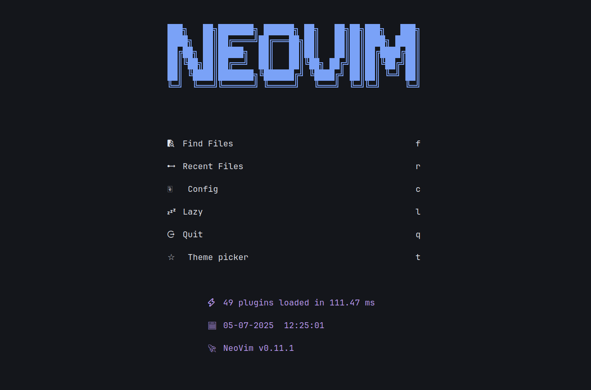
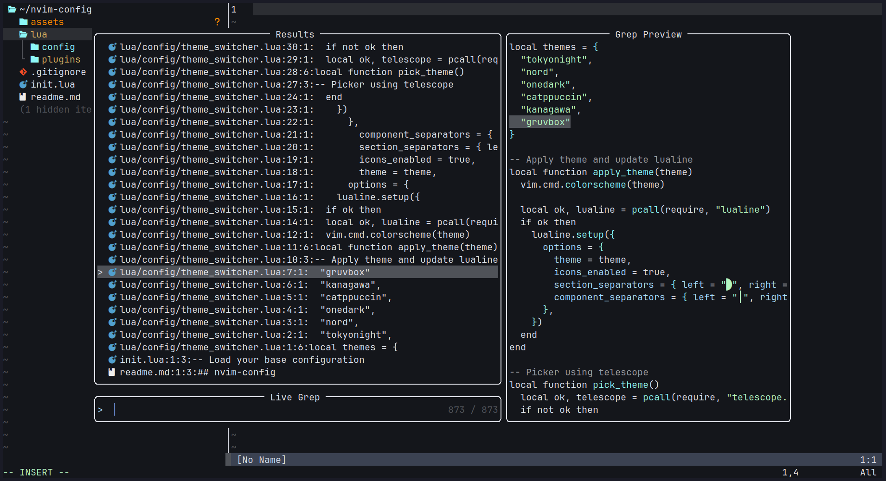
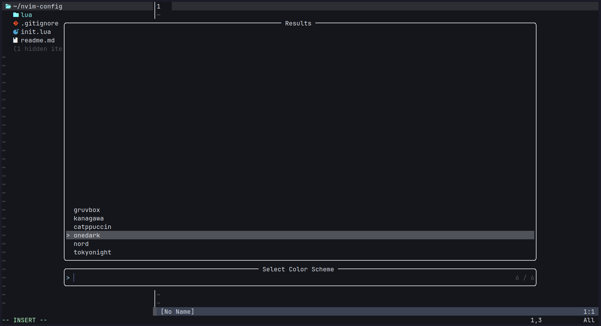
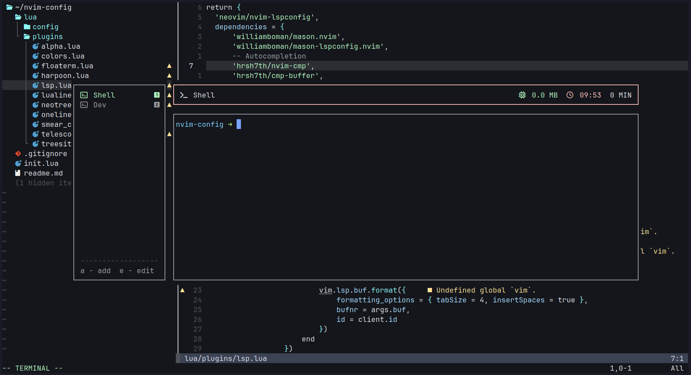

## 📝 nvim-config

A sleek and personalized Neovim setup crafted for **productivity**, **aesthetics**, and an enhanced coding experience.

---

### 📸 Screenshots

<div align="center">
  
  <br><br>
  
  
</div>

---

### ⚙️ Installation

```bash
# Clone the config
git clone https://github.com/Aman-m01/nvim-config.git ~/.config/nvim && nvim

# Optional: remove .git and assets to clean up
rm -rf ~/.config/nvim/.git ~/.config/nvim/assets

# Uninstall
rm -rf ~/.config/nvim
rm -rf ~/.local/state/nvim
rm -rf ~/.local/share/nvim

```

# Shortcuts

Some of the shortcuts I use frequently are mentioned here.

| Shortcut          | Description                                      |
| ----------------- | ------------------------------------------------ |
| `<leader>ff`      | Fuzzy file searching in a floating window        |
| `<leader>fh`      | Fuzzy help file grepping in a floating window    |
| `<leader>fg`      | Fuzzy project-wide grepping in a floating window |
| `<leader>th`      | theme swithcer -> telescope                      |
| `:FloatermToggle` | open floating terminal inside the neovim         |
| `:Texplore`       | open tree toggle                                 |

## 🙏 Thanks
